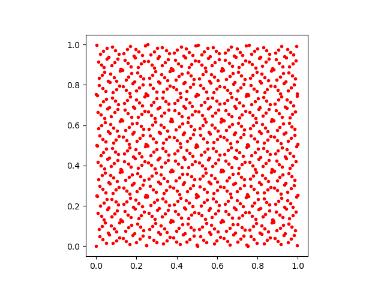

# The Sobol module for Julia
[](https://github.com/JuliaMath/Sobol.jl/actions?query=workflow%3ACI)

This module provides a free [Julia-language](http://julialang.org/)
[Sobol low-discrepancy-sequence
(LDS)](https://en.wikipedia.org/wiki/Sobol_sequence) implementation.  This
generates "quasi-random" sequences of points in N dimensions which are
equally distributed over an N-dimensional hypercube.

The advantage of an LDS over truly random (or pseudo-random) numbers is
that an LDS (which is *not* random) tends to be more evenly
distributed for finite numbers of points.  This is used in
[quasi-Monte Carlo
methods](https://en.wikipedia.org/wiki/Quasi-Monte_Carlo_method) in
order to accelerate convergence compared to traditional [Monte Carlo
methods](https://en.wikipedia.org/wiki/Monte_Carlo_method) employing
random sequences.

It can be installed using the Julia package manager via `Pkg.add("Sobol")`.

## Algorithm

This is an independent implementation, originally by Steven G. Johnson, of the
algorithm for generation of Sobol sequences in up to 21201 dimensions
described in:

* P. Bratley and B. L. Fox, [Algorithm 659: Implementing Sobol's quasirandom sequence generator][bratley88],
  *ACM Trans. Math. Soft.* **14** (1), pp. 88-100 (1988), [doi:10.1145/42288.214372][bratley88].
* S. Joe and F. Y. Kuo, [Remark on algorithm 659: Implementing Sobol's quasirandom sequence generator][joe03],
*ACM Trans. Math. Soft* **29** (1), 49-57 (2003), [doi:10.1145/641876.641879][joe03].

[bratley88]: https://dl.acm.org/citation.cfm?id=214372
[joe03]: https://dl.acm.org/citation.cfm?id=641879

Originally implemented in C in 2007 as
[part of](https://github.com/stevengj/nlopt/blob/master/util/sobolseq.c) the
[NLopt library](http://ab-initio.mit.edu/nlopt) for nonlinear optimization, the
code was subsequently converted by [Ken-B](https://github.com/Ken-B) into pure Julia with roughly the same performance.

It is important to emphasize that SGJ's implementation was based on the
mathematical description of the algorithms only, and was done without
reference to the Fortran code from the *Trans. Math. Soft.* (*TOMS*)
papers.  The reason is that *TOMS* code is not free/open-source
software (it falls under [restrictive ACM copyright
terms](http://www.acm.org/publications/policies/softwarecrnotice)).
(SGJ did re-use a table of primitive polynomials and coefficients from
the *TOMS* code, but since this is merely a tabulation of mathematical
facts it is not copyrightable.)  SGJ's implementation in NLopt, along
with this Julia translation, is free/open-source software under the [MIT
("expat") license](http://opensource.org/licenses/MIT).

Direction numbers used were derived from the file
http://web.maths.unsw.edu.au/~fkuo/sobol/new-joe-kuo-6.21201

Technically, we implement a 32-bit Sobol sequence.  After
2<sup>32</sup>-1 points, the sequence terminates, and subsequently
our implementation returns pseudo-random numbers generated by the
[Mersenne Twister](https://en.wikipedia.org/wiki/Mersenne_twister) algorithm.
In practical applications, however, this point is rarely reached.

## Usage

To initialize a Sobol sequence `s` in `N` dimensions (`0 < N < 21201`), use
the `SobolSeq` constructor:
```julia
using Sobol
s = SobolSeq(N)
```
Then
```julia
x = next!(s)
```
returns the next point (a `Vector{Float64}`) in the sequence; each point
lies in the hypercube [0,1]<sup>N</sup>.   You can also compute the next
point in-place with
```julia
next!(s, x)
```
where `x` should be a `Vector` of length `N` of some floating-point type (e.g. `Float64`, `Float32`, or `BigFloat`).

You can also use a `SobolSeq` as an iterator in Julia:
```julia
for x in SobolSeq(N)
   ...
end
```
Note, however, that the loop will *never terminate* unless you explicitly
call `break` (or similar) in the loop body at some point of your choosing.

We also provide a different `SobolSeq` constructor to provide
an `N`-dimensional Sobol sequence rescaled to an arbitrary hypercube:
```julia
s = SobolSeq(lb, ub)
```
where `lb` and `ub` are arrays (or other iterables) of length `N`, giving
the lower and upper bounds of the hypercube, respectively.   For example,
`SobolSeq([-1,0,0],[1,3,2])` generates points in the box [-1,1]×[0,3]×[0,2].  (Although the generated points are `Float64` by default, in general the precision is determined by that of `lb` and `ub`.)

If you know in advance the number `n` of points that you plan to
generate, some authors suggest that better uniformity can be attained
by first skipping the initial portion of the LDS. In particular,
we skip 2ᵐ−1 for the largest `m` where `2ᵐ-1 ≤ n` (see [Joe and Kuo, 2003][joe03] for a similar suggestion).  This
facility is provided by:
```julia
skip(s, n)
```

Skipping exactly `n` elements is also possible:

```julia
skip(s, n, exact=true)
```

`skip` mutates and returns `s`, so you can simply do `s = skip(SobolSeq(lb, ub), n)` or similar.

## Example

Here is a simple example, generating 1024 points in two dimensions and
plotting them with the [PyPlot](https://github.com/stevengj/PyPlot.jl)
package.  Note the highly uniform, nonrandom distribution of points in
the [0,1]×[0,1] unit square!
```julia
using Sobol
using PyPlot
s = SobolSeq(2)
p = reduce(hcat, next!(s) for i = 1:1024)'
subplot(111, aspect="equal")
plot(p[:,1], p[:,2], "r.")
```


## Author

This module was written by [Steven G. Johnson](http://math.mit.edu/~stevenj/).
